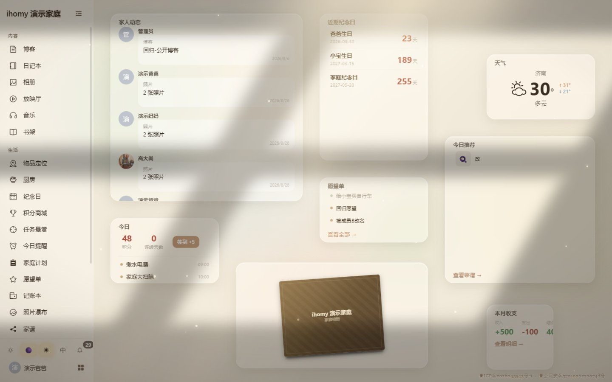
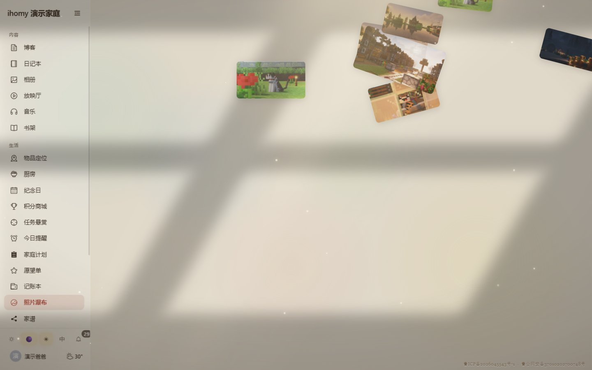
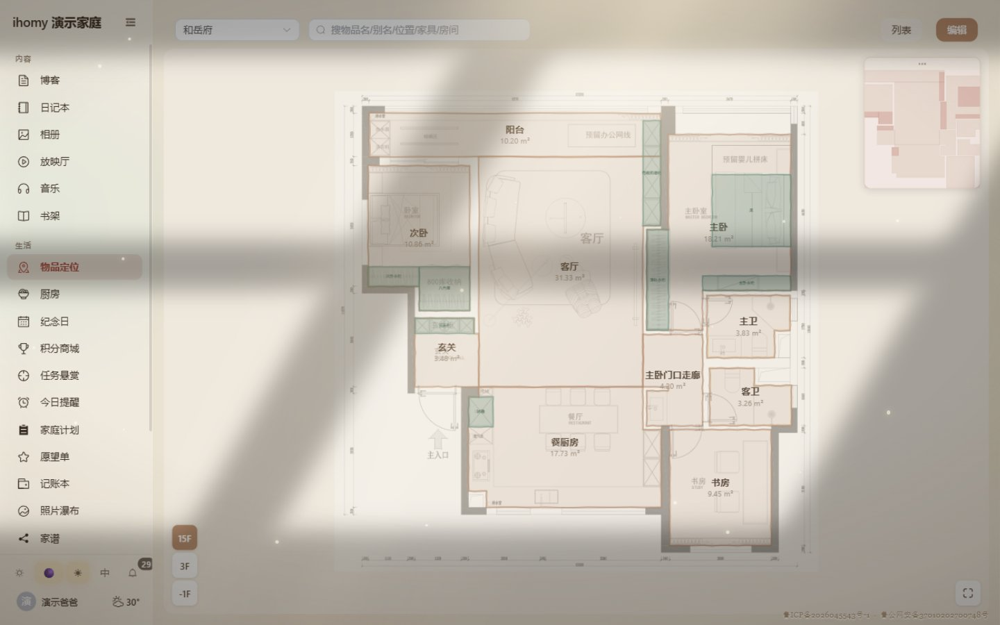
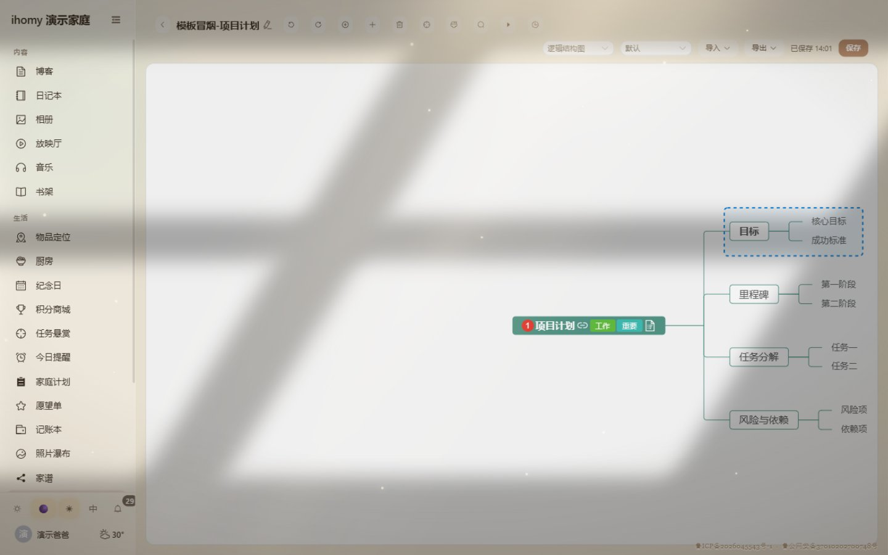

# ihomy

面向家庭成员的内容共享平台，支持 PC 浏览器 / 安卓 / iOS（均为 PWA）。为家庭提供一个私密、温暖的数字空间：记录生活、共享回忆、协作日常。

## 截图

| 首页 · 沉浸式光影 | 照片瀑布流 |
|:---:|:---:|
|  |  |
| 物品定位 · 户型图画布 | 工具箱 · 脑图设计 |
|  |  |

## ✨ 特性亮点

- **光影系统**：首页按**真实太阳位置**渲染室内光照——太阳方位、亮度、色温随时间流动，窗户投影与台灯夜光联动和风天气（晴天暖光 / 阴天冷调 / 雨雪粒子），清晨与黄昏各有表情。这是 ihomy 区别于普通家庭应用的核心体验。
- **物品定位 · 户型图画布**：自绘房子 / 房间 / 家具三级平面图，物品落在真实坐标上，找东西点开即见；支持底图 PDF 标定、多楼层、库内家具拖入摆放。
- **工具箱 · 协同脑图**：内嵌脑图设计器，历史版本快照与回滚，多端协同编辑（乐观锁 + 轮询裁决）。
- **首页模块化**：插一条 `sys_home_module` 记录即扩展一个首页模块，前端零框架改动。
- **多家庭与权限分级**：OWNER / MEMBER / CHILD / GUEST 四级家庭角色 + 独立运维角色 OPS，业务数据严格按家庭隔离。

## 功能概览

- **内容**：博客、日记（含手绘涂鸦）、相册、放映厅、照片瀑布流、愿望单、书架（epub 阅读器）、背景音乐
- **生活**：纪念日（阳历/农历）、提醒、家庭计划、任务悬赏、记账、家谱、菜单菜谱与食材
- **互动**：点赞、评论、通知、聊天室（WebSocket 实时）
- **系统**：签到积分与商城、多家庭切换、i18n 中英双语、明暗主题、运维后台（tid 日志追溯 / 三方调用审计）

## 技术栈

| 端 | 技术 |
|----|------|
| 前端 | Vue 3 + Vite + Element Plus + Pinia + vue-i18n + GSAP + PWA |
| 后端 | Spring Boot 3（JDK 21 虚拟线程）+ MyBatis-Plus + JWT 双 token |
| 数据 | MySQL 8 + Redis（缓存 / 验证码 / 令牌黑名单） |
| 通信 | REST + WebSocket（聊天室） |

## 文档与上手

- 完整文档索引见 **[docs/README.md](docs/README.md)**：架构设计、需求设计说明书（61 表数据库设计 + 接口清单）、变更归档、UI 设计规格、日志规范与排查方法论。
- 生产部署流程见 [docs/部署指导-Linux.md](docs/部署指导-Linux.md) 与 [docs/部署指导-Windows.md](docs/部署指导-Windows.md)（脱敏入库版，凭证一律占位符）；新人环境搭建文档与生产凭证台账由维护者本地保管，不入仓库。`schema.sql` 为开发安全版随仓库提供（仅含本机 Docker 开发凭证，生产凭证一律走 external.yml 外挂文件，不入仓库）。
- 每次推送自动跑 CI：前后端构建 + compose 起库导入 schema + 后端启动 + 登录冒烟，保证仓库在全新机器上自给自足。

## License

GPL-3.0
