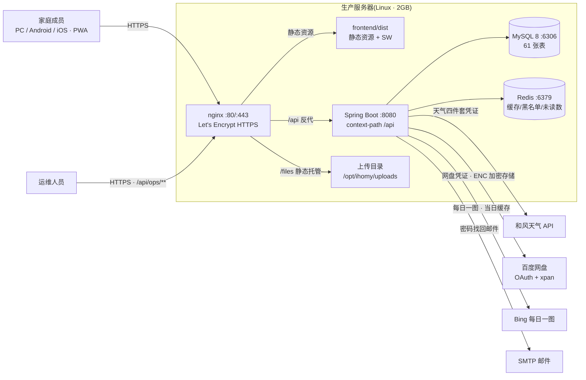
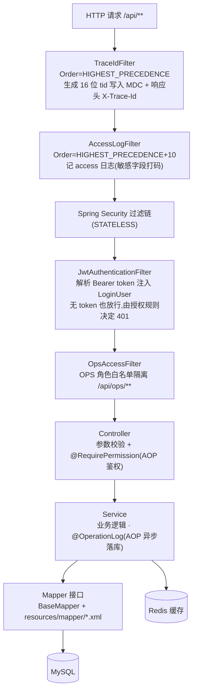
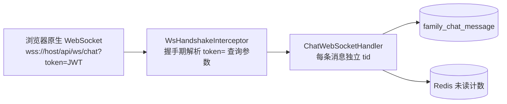
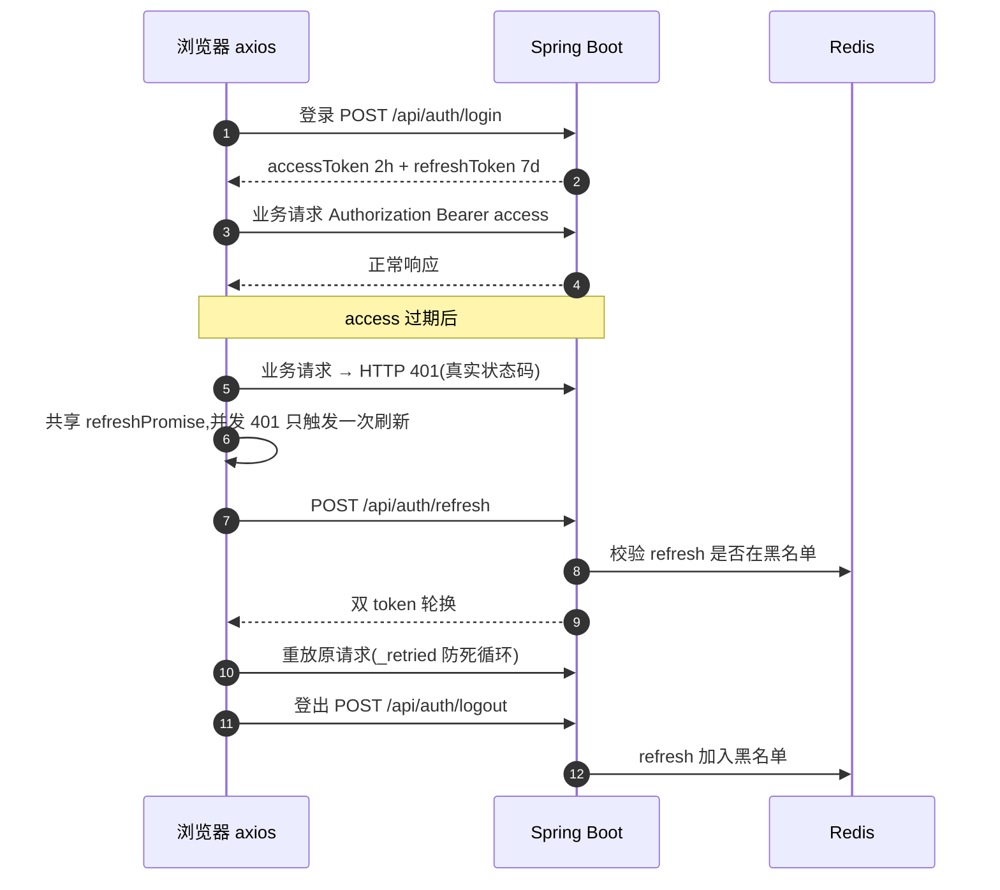
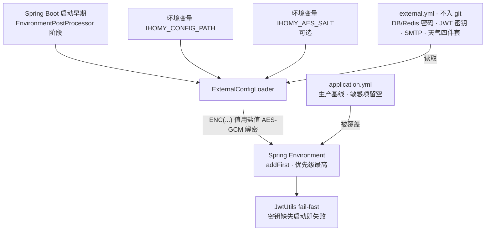
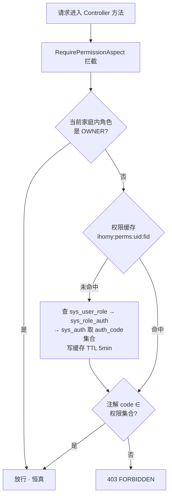
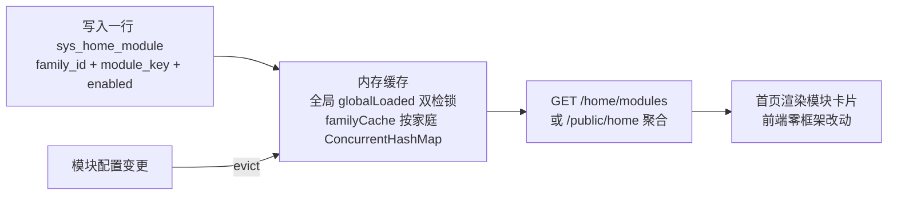
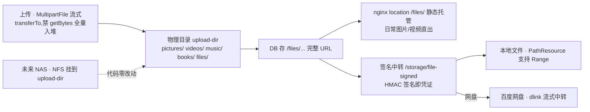
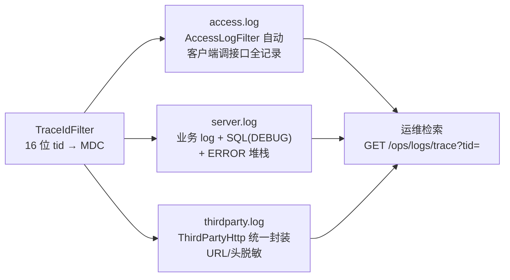
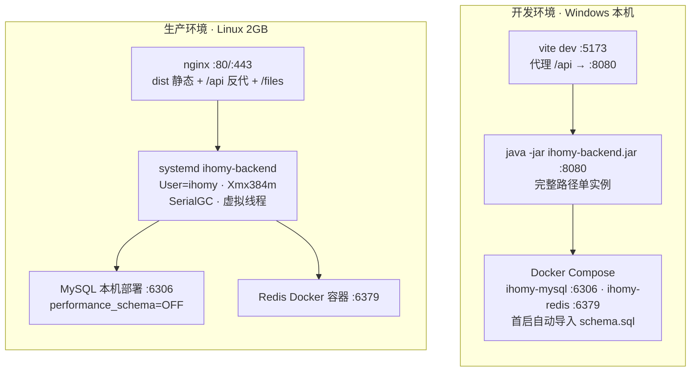

# ihomy 架构设计

> **定位**:给新成员(及 AI 辅助开发)建立系统全局心智模型——系统由哪些部分组成、一个请求怎么走、为什么关键机制这样设计。规则与约定见 `AGENTS.md`,完整功能需求见 `docs/需求设计说明书.md`,历史踩坑见 `docs/变更归档.md`,本文不重复。
> **数字口径**:61 张表 / 33 个 Controller / service 包 44 个类 / 53 个活跃实体 / 54 个 Mapper(17 个自定义 XML),均为 2026-09-07 对照代码实测,复核方法见文末附录。

## 1. 系统上下文(C4 Level 1)

ihomy 是家庭内部的内容共享平台,前后端分离:Vue3 PWA 构建产物由 nginx 托管,所有业务请求经 nginx 反代到 Spring Boot;MySQL 持久化,Redis 做缓存/令牌黑名单/未读计数,上传文件落本地磁盘由 nginx 静态托管。出站第三方共四个:和风天气(光影系统)、百度网盘(存储设备映射)、Bing 每日一图(首页每日内容)、SMTP(密码找回邮件),前三者统一经 `ThirdPartyHttp` 封装出站(自动 thirdparty 日志 + 脱敏)。

要点:

- **一套代码三端覆盖**:浏览器直接访问,移动端"添加到主屏幕"即 PWA(iOS 要求 HTTPS),不维护原生 App。
- **文件不过后端的手就不走后端**:nginx 直接托管 `/files/`,后端只在"百度网盘中转 / Range 播放 / 签名 URL"场景流式代理(见 §4.5)。
- **家庭是隔离边界**:所有业务表带 `family_id`,跨家庭访问一律 NOT_FOUND(而非 403,不泄露存在性)。

## 2. 请求流转

### 2.1 HTTP 主链路

一个业务请求从 nginx 到 MySQL,依次经过两个 Servlet 过滤器(先于 Security 链,`@Order` 决定)和 Spring Security 链内的两个自定义过滤器,再进入三层业务代码:

约定背后的设计:

- **tid 在最前**:TraceIdFilter 排在一切之前,保证 access 日志和后续所有日志共享同一 tid,排障时可跨文件串联(见 §4.6)。
- **认证与授权分离**:JwtAuthenticationFilter 只负责"解析出是谁",不拦请求;拦不拦由 SecurityConfig 的 `authorizeHttpRequests` 规则(公开白名单 + `anyRequest().authenticated()`)和 `@RequirePermission` 切面(功能级权限)决定。读类 GET 接口(博客列表/相册/评论等)对匿名开放,写类一律登录。
- **Mapper 不写注解 SQL**:接口仅继承 BaseMapper,自定义 SQL 全放同名 XML,参数统一 `@Param`——SQL 集中可审,避免注解里拼长串。

### 2.2 WebSocket 聊天(独立一条路)

聊天室不走 HTTP 过滤链,握手期自行校验 JWT:

前端用 `${base}/api/ws/chat?token=` 连接(开发走 vite 代理,生产走 nginx WebSocket 升级);HTTP 侧的 `/chat` 接口只负责历史消息与已读标记。

## 3. 模块分域

后端 33 个 Controller / service 包 44 个类,按业务域分组如下(域划分与 `AGENTS.md` 功能模块清单一致):

| 域 | Controller(33) | 关键 Service | 一句话职责 |
|----|----------------|--------------|-----------|
| 账号 | Auth / Profile | Auth / Captcha / Parameter | 注册登录、验证码、密码找回、多家庭切换、个人资料 |
| 家庭 | Family / Member | MultiFamily / MemberManagement | 家庭管理、成员角色、邀请码、入家申请 |
| 内容 | Blog / Diary / Album / Photo / Cascade / Video / Wish / Library | 六个同名 Service + Album、Video 各配 MapService+MapRunner | 博客、日记、相册照片、照片瀑布、放映厅、愿望单、书架 |
| 互动 | Like / Comment / Notification / Chat | ContentLike / Comment / Notification / Chat | 点赞、评论树、通知、实时聊天 |
| 生活 | Anniversary / Reminder / Plan / Task / Book / Tree / Points / Music | 八个同名 Service + Music 的 MapService+MapRunner | 纪念日、提醒、计划、任务悬赏、记账、家谱、签到积分、背景音乐 |
| 基础 | File / Storage / Home / Public / Daily / Ops | File / Storage / SignedUrl / Thumbnail / HomeModule / HomeStats / ActivityFeed / Ops / OperationLog / MapTaskRegistry | 上传、存储设备、首页聚合、公开端点、每日内容、运维 |
| 光影 | 无独立 Controller(挂 Public 下) | Sun / Weather | 真实太阳位置 + 和风天气联动,首页沉浸式光影 |
| 物品 | Item | Item | 房子/房间/家具/物品五级粒度 + 户型图画布 |
| 厨房 | Recipe | Recipe | 菜单推荐、菜谱、食材 |
| 工具 | MindMap | MindMap | 脑图设计(快照/回滚/协同轮询) |

前端与后端域一一对应:`api/index.js` 31 个 Api 对象按模块分组,`views/` 43 个页面组件挂 39 条懒加载路由,Pinia 只有两个全局 store(user 登录态 + app 首页聚合)——**业务状态分散在各页面自行管理,不搞大 store**,页面间共享的只有登录态与首页聚合数据。

内容/生活/基础三域里的"映射套件"(Album、Video、Music 各配 MapService + MapRunner,共用基础域的 MapTaskRegistry)是存储设备目录映射的异步执行单元:勾选网盘目录后建影子相册/视频/曲目,不拷贝文件,进度可查。

## 4. 关键机制(为什么这样设计)

### 4.1 无状态会话:JWT 双 token + 真 401

access 2h / refresh 7d,refresh 时**双 token 全量轮换**(滑动续期),只有连续 7 天不访问才需要重新登录;登出把 refresh token 放进 Redis 黑名单。

**为什么 entryPoint 必须返回真实 HTTP 401**(2026-09-01 踩坑):前端 axios 只对 HTTP 状态码 401 触发 refresh 流程;如果只在 JSON body 里写 401 而状态码保持 200,续期逻辑永不执行,用户每 2 小时被登出。这是前后端之间最硬的一条契约。

### 4.2 外挂配置链:生产基线 + 环境覆盖

`application.yml` 是**生产基线**(端口/连接池/路径全部按生产写,敏感项留空),所有环境差异(开发密码、Windows 路径、captcha 固定值、天气凭证、JWT 密钥)统一由 `IHOMY_CONFIG_PATH` 指向的 external.yml 覆盖,不维护 dev profile。

**为什么**:① 敏感凭证与仓库物理隔离(external.yml 进 .gitignore,模板入库),杜绝生产密码入库;② 加载发生在 DataSource/Redis 初始化之前,且注入为最高优先级,保证"基线可被完全覆盖"而非"两边拼接";③ JWT 密钥缺失直接启动失败(fail-fast),避免带空密钥上线。开发环境由 `scripts/setup.ps1` 生成、`start-all.ps1` 注入,新人零手工配置。

### 4.3 权限模型:OWNER 恒真 + auth_code 种子 + OPS 隔离

四级家庭角色 OWNER/MEMBER/CHILD/GUEST + 独立的运维角色 OPS。功能级权限走 `@RequirePermission("code")` 注解 + AOP 切面:

**为什么 OWNER 恒真**:家庭是私有空间,家长天然拥有全部权限,不维护"OWNER 的权限清单"——新增功能时 OWNER 无需配种子即可用。代价是**新增带 `@RequirePermission` 的接口必须把 auth_code 写进 `sys_auth` + `sys_role_auth` 种子**(MEMBER 显式授权),否则 403。

**OPS 隔离**(OpsAccessFilter,位于 JWT 过滤器之后):OPS 不属任何家庭,只能访问 `/api/ops/**` + `/api/auth/**`,其余 403;非 OPS 访问 `/api/ops/**` 同样 403。支持复合角色(OWNER+OPS),角色绑定查询带 5 分钟缓存。这样运维账号即使泄露也摸不到家庭数据。

**多家庭**:同一用户可在多个家庭持不同角色(`sys_user_role.family_id` 区分),JWT 里的 familyId 是切换时刻的快照,refresh 时按 `default_family_id` 优先级重新解析。

### 4.4 首页模块化:插一条记录即扩模块

首页的模块卡片由 `sys_home_module` 表驱动:插入一行(family_id + module_key + enabled + 排序)即出现新模块入口,前端 `stores/app.js` 聚合渲染,**加功能不改前端框架代码**。

**为什么内存缓存 + 懒加载兜底而不是只靠预热**(2026-09-01 生产事故):`@PostConstruct` 预热阶段 mapper 偶发未就绪,曾导致全局模块永久为空、导航只剩设置/运维。改为预热失败不致命 + 首次查询走 `globalLoaded` 双检锁自动加载。模块配置是典型读多写少数据,Redis 都不必上,进程内 Map + 变更 evict 足够。

### 4.5 文件存储:/files URL 与物理根解耦

DB 只存 `/files/...` 完整 URL,物理位置由 `file.upload-dir` 决定(生产 `/opt/ihomy/uploads`,开发经 external.yml 指向 Windows 路径)——**换存储后端不动业务代码**。

**为什么**:`/files` URL 是稳定契约,物理根是可变实现——未来接 NAS 只需 NFS 挂载到同一目录,代码零改动;需要跨域授权/网盘中转时走签名 URL(HMAC 签名本身即凭证,无需登录态),本地中转用 PathResource 保 Range 播放,网盘用 InputStreamResource 流式拉 dlink。上传必须流式(`-Xmx384m` 的生产 JVM 经不起 200MB 文件入堆)。

### 4.6 日志:三类分流 + tid 贯穿

日志按读者分三个文件,按天滚动保留 7 天;tid(16 位短 UUID)由 TraceIdFilter 最先生成、写入 MDC,贯穿全部三类日志与 `X-Trace-Id` 响应头,`@Async` 线程经 TaskDecorator 自动传递,WS 每条消息独立 tid。

**为什么分三类**:access 面向"谁在什么时候调了什么"(量大、格式固定),server 面向"内部流程与排障"(含 SQL 与堆栈),thirdparty 面向"出站调用审计与配额"(天气 API 用量)。混在一个文件里,流量日志会把真正的错误堆栈冲掉。运维页按 tid 跨三类文件检索,前端 5xx 报错 toast 自带 tid,业务人员报障即可直达现场。

## 5. 部署拓扑:开发 vs 生产

两端端口完全一致(MySQL 6306 / Redis 6379 / 后端 8080),差异只在"谁托管中间件、谁托管前端":

| 差异点 | 开发 | 生产 |
|--------|------|------|
| 中间件 | Docker Compose 一键(MySQL+Redis 都进容器) | MySQL 本机(调优后 ~180MB,不给它常驻 Docker daemon)+ Redis 容器 |
| 前端 | vite dev server,代理 /api | nginx 托管 dist,PWA SW 更新 |
| 后端 | 命令行起 jar,external.yml 指向仓库外路径 | systemd 管理,专用 `ihomy` 用户,`-Xmx384m -XX:MaxMetaspaceSize=192m -XX:+UseSerialGC -Xss512k` |
| 验证码 | external.yml 固定 `qwer` | 真图形验证码 |
| 配置注入 | start-all.ps1 设 IHOMY_CONFIG_PATH | systemd Environment 指向服务器上的 external.yml(不入 git) |

**为什么 2GB 生产机这样分**:MySQL 调优后本机部署最省内存;Redis 轻量且升级频繁,容器化;后端用虚拟线程(JDK 21)在小堆下也能扛 IO 密集负载。SSH 端口统一 19068(禁 22)。详细步骤在本地 `Linux部署指导.md` / `Windows部署指导.md`(不入 git)。

## 附录:数字口径与复核方法

2026-09-07 对照代码实测(引用本文数字前如隔久建议复核;命令在仓库对应源码目录执行):

| 项 | 数值 | 复核命令(backend 目录) |
|----|------|------------------------|
| 数据表 | 61(sys_ 18 / family_ 22 / content_ 21) | `grep -c "^CREATE TABLE" src/main/resources/schema.sql` |
| Controller | 33 | `ls src/main/java/com/ihomy/controller \| grep -c Controller.java$` |
| service 包类 | 44(40 个 @Service + 3 个映射 Runner + 1 个 MapTaskRegistry,均 @Component) | `ls src/main/java/com/ihomy/service \| wc -l` |
| 实体 | 54 个文件,53 个活跃 | `ls src/main/java/com/ihomy/entity \| wc -l` |
| Mapper | 54 接口 / 17 个自定义 XML | `ls src/main/resources/mapper \| wc -l` |
| 路由 / 页面 / Api 对象 | 39 / 43 / 31(frontend/src) | `grep -c "import(" src/router/index.js` 等 |

**已知死代码**:`entity/FamilyMusic.java` + `mapper/FamilyMusicMapper.java` 映射已不存在的 `family_music` 表(该表重构为 `content_music`),二者仅互相引用、无业务调用,留待清理;因此"活跃实体 = 53"。无实体的 8 张表:`content_book_category_rel` / `content_visibility` / `sys_auth` / `sys_dict_item` / `sys_password_reset_token` / `sys_role_auth` / `sys_user_group` / `sys_user_group_member`(纯关联/字典表,经自定义 XML 或其他实体访问)。
